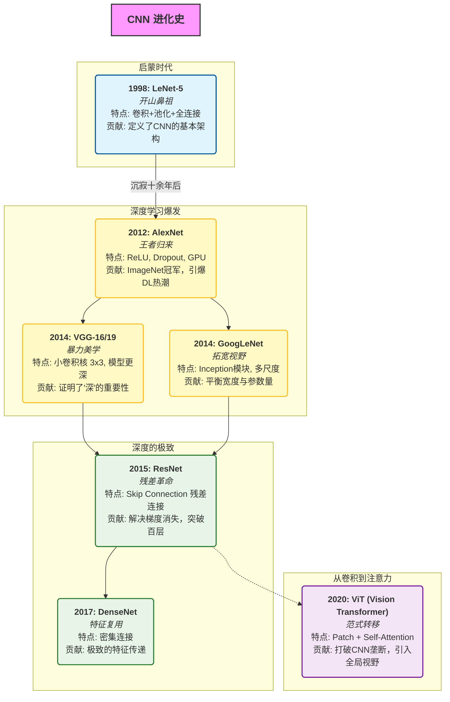
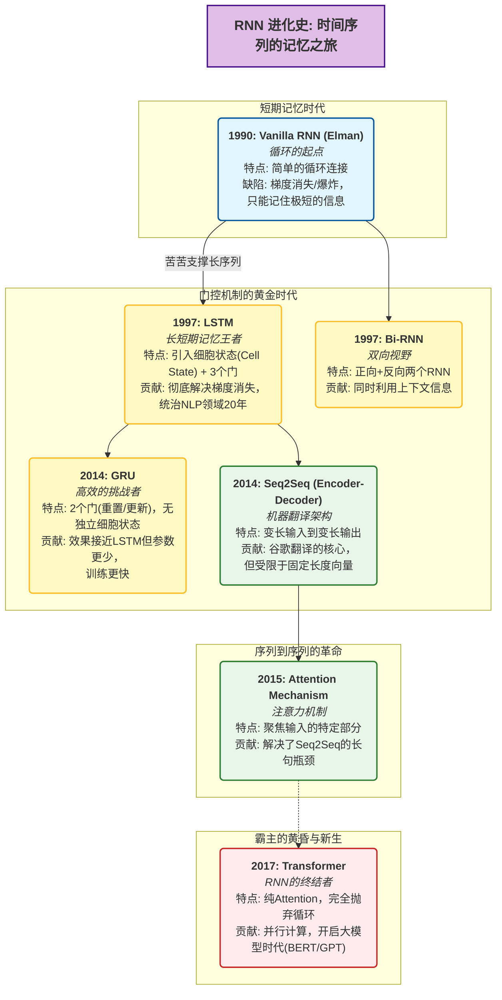
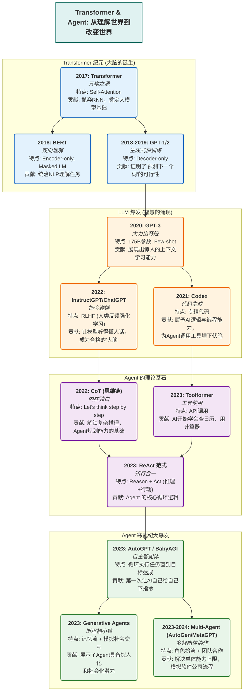

# GarlicBird(蒜鸟) DeepLearning Learning Note
## What is this repo?

Two old friends with backgrounds outside of AI(Physics and Chemistry, so basically science nuts) trying to learn the machine learning area step by step. We decide to reproduce the very classic papers to learn. And we find it nice to share the learning path and learning material online. We know that there is tons of learning tutorials, and our ones is nothing special to those. However, it never hurts to share(that's the spirit). 

### Our reading plan

**For the deep learning part:**

1. LeNet-5
2. AlexNet and ResNet
3. LSTM and transformer
4. GANs
5. more...(deciding after we learn and reproduce the result)

## Road maps

### Road maps of CNN

### Road map of RNN

### Road maps of Transformer & Agents

